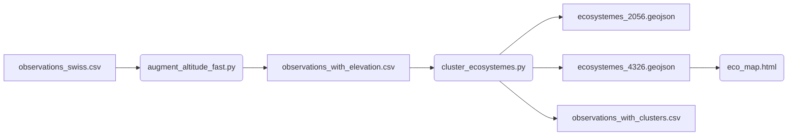

# 🏔️ Swiss Ecosystems

## 🌿 Context

**Swiss Ecosystems** is a project for studying and mapping **Swiss ecosystems** based on geolocated fauna and flora observations.

The objective is to:
1. **Enrich observations** with official Swiss altitudes (swissALTI3D),
2. **Identify coherent ecological zones** via spatial clustering,
3. **Dynamically visualize** the ecosystems on an interactive web map.

The full pipeline goes from raw CSV observations to an interactive Leaflet map showing colored, interactive ecosystem polygons.

---

## ⚙️ Prerequisites

### 🐋 Docker and Docker Compose
All processing (PostGIS, GDAL, Python scripts) runs inside Docker containers.  
Ensure Docker is installed and working:

```bash
docker --version
docker compose version
```

---

## 🚀 Usage

### 1️⃣ Container setup

1. Clone the repository:
   ```bash
   git clone https://github.com/yourusername/swiss-ecosystems.git
   cd swiss-ecosystems
   ```

2. Start the containers:
   ```bash
   docker compose up -d
   ```

   This launches:
   - **faune_postgis** → PostGIS database for raster handling
   - **gdal_tools** → GDAL & Python tools (`/data/tools`)
   - **shared volume** mounted at `./data`

3. Check that everything is running:
   ```bash
   docker ps
   ```

---

### 2️⃣ Altitude — CSV enrichment

#### Goal
Add **real altitude values** from the **swissALTI3D** model to each fauna/flora observation.

#### Steps

##### a) Download swissALTI3D tiles

- The script `filter_swissalti3d_urls.py` extracts `.tif` URLs from the file `ch.swisstopo.swissalti3d-links.csv`:
  ```bash
  python3 /data/tools/filter_swissalti3d_urls.py
  ```

- Then download all tiles:
  ```bash
  bash /data/tools/import_tiles.sh
  ```

  > The `.tif` tiles are stored under `/data/swissALTI3D_tuiles/`.

---

##### b) Compute altitude for each observation

Run the script inside the `gdal_tools` container:

```bash
docker exec -it gdal_tools bash
cd /data/tools

python3 augment_altitude_fast.py   --in /data/observations_swiss.csv   --out /data/observations_with_elevation.csv   --tif-dir /data/swissALTI3D_tuiles   --workers 6
```

This script:
- reads each observation (`longitude`, `latitude`),
- converts to Swiss coordinates (LV95 / EPSG:2056),
- extracts altitude from the matching raster tile,
- writes a new CSV with an added column `elevation_m`.

---

### 3️⃣ Clusters — ecosystem creation

#### Goal
Group nearby observations in space and altitude → **ecosystem clusters**.

#### Execution

In `gdal_tools`:

```bash
python3 /data/tools/cluster_ecosystemes.py   --in-csv /data/observations_with_elevation.csv   --out-csv /data/observations_with_clusters.csv   --out-geojson-2056 /data/ecosystemes_2056.geojson   --out-geojson-4326 /data/ecosystemes_4326.geojson   --eps 80   --min-samples 10   --alt-scale 50
```

Parameters:
- `eps`: maximum neighborhood radius (meters, EPSG:2056)
- `min-samples`: minimum number of observations to form a cluster
- `alt-scale`: altitude normalization factor

The script:
- applies **DBSCAN clustering**,
- outputs a GeoJSON in **EPSG:2056** for QGIS,
- and a **EPSG:4326** version for the web (Leaflet), using GDAL (`ogr2ogr`).

Outputs:
```
/data/observations_with_clusters.csv
/data/ecosystemes_2056.geojson
/data/ecosystemes_4326.geojson
```

---

### 4️⃣ Visualization — interactive map

#### Goal
Display the ecosystems and their taxons on a web map.

#### Steps

1. Copy into the same folder:
   ```
   eco_map.html
   ecosystemes_4326.geojson
   observations_with_clusters.csv
   ```

2. Start a lightweight local web server:
   ```bash
   python -m http.server 8000
   ```

3. Open in your browser:
   👉 http://localhost:8000/eco_map.html

4. **Interactions**
   - Each colored polygon = one ecosystem (DBSCAN cluster)
   - Hover → taxon list and observation counts
   - Click → popup with taxon details

---

## 🧭 Pipeline summary



---

## 📂 Project structure

```
/data
 ├── observations_swiss.csv
 ├── observations_with_elevation.csv
 ├── observations_with_clusters.csv
 ├── swissALTI3D_tuiles/
 ├── ecosystemes_2056.geojson
 ├── ecosystemes_4326.geojson
 └── tools/
      ├── augment_altitude_fast.py
      ├── cluster_ecosystemes.py
      ├── import_tiles.sh
      ├── filter_swissalti3d_urls.py
      └── eco_map.html
```

---

## 🧠 Additional notes

- **DBSCAN** detects dense spatial clusters. Points with `cluster_id = -1` are isolated observations.
- **EPSG:2056 (LV95)** is used for metric computations.
- **EPSG:4326 (WGS84)** is used for web visualizations.
- Ecosystem polygons are generated as the union of circles of radius `eps` around each cluster observation.

---

## 🪶 Author & License

**Author:** [Your name or organization]  
**License:** MIT  
**Version:** 1.0

> 💡 *Swiss Ecosystems* bridges raw biodiversity data and geographical context to identify and visualize meaningful ecological zones across Switzerland.
